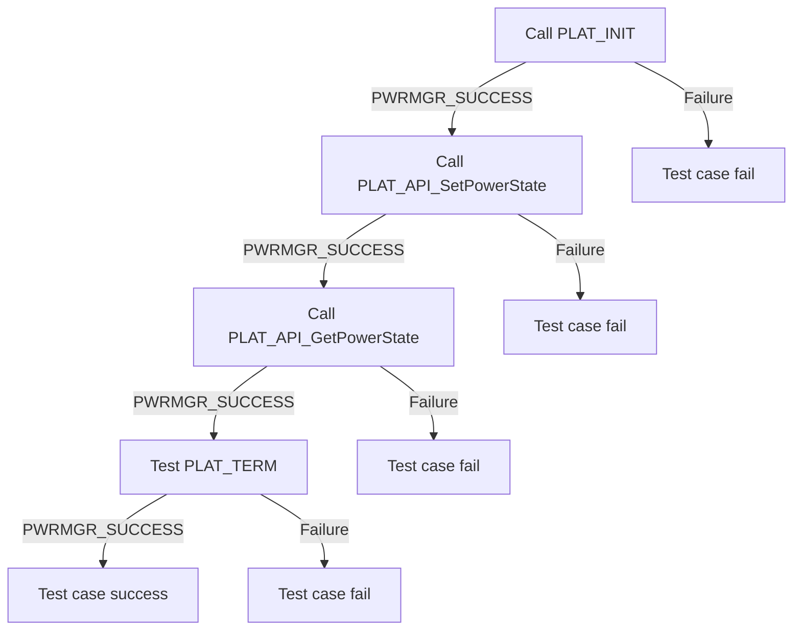

# L2 Test Specification template

## Version History

|Date(DD/MM/YY)|Comment|Version|
|--------------|-------|-------|
|20/02/24|First Release|1.0.0|

## Table of Contents

- [Overview](#overview)
  - [Acronyms](#acronyms-terms-and-abbreviations)
  - [Definitions](#definitions)
  - [References](#references)
- [Level 2 Test Suite](#level-2-test-suite)
  - [Set And Get Power States](#set-and-get-power-states)
  - [Set and Get Status of Wakeup Sources](#set-and-get-status-of-wakeup-sources)
  - [Testing Wakeup Source](#testing-wakeup-source)
  - [Test Reset Functionlity](#test-reset-functionlity)

## Overview

This document describes the level 2 testing suite for the module.

### Acronyms, Terms and Abbreviations

- `HAL` \- Hardware Abstraction Layer, may include some common components
- `HAL.h`  \- Abstracted defined API to control the hardware
- `HAL.c`  \- Implementation wrapper layer created by the `OEM` or `SoC` Vendor.
- `RDK`  \- Reference Design Kit for All Devices
- `RDK-B`  \- Reference Design Kit for Broadband Devices
- `RDK-V`  \- Reference Design Kit for Video Devices
- `UT`  \- Unit Test(s)
- `OEM`  \- Original Equipment Manufacture (Sky is also an OEM)
- `SoC`  \- System on a Chip
- `NA` \- Not Applicable

### Definitions

- `Broadcom` \- `SoC` manufacturer <https://www.broadcom.com/>
- `Amlogic` \- `SoC` manufacturer <https://en.wikipedia.org/wiki/Amlogic>
- `Soc Vendor` \- Definition to encompass multiple vendors
- `Unit Tests` \- C Function tests that run on the target hardware
- `Common Testing Framework` \- Off the shelf 3rd Party Testing Framework, or framework that does not require infrastructure to control it. That's not to say it cannot be controlled via infrastructure if required. Examples of which are.
  - `GTest` \- Google Test Suit <https://google.github.io/googletest>
  - `CUnit` \- C Testing Suit <http://cunit.sourceforge.net/>
  - `Unity` \- C Embedded Testing Suit <http://www.throwtheswitch.org/unity>
  - `ut-core` \- Common Testing Framework <https://github.com/rdkcentral/ut-core>, which wraps a open-source framework that can be expanded based on future requirements.

### References

- `Feedback Loops` \- <https://www.softwaretestingnews.co.uk/4-methods-to-improve-your-feedback-loops-and-supercharge-your-testing-process/>
- `Doxygen` \- SourceCode documentation tool - <https://www.doxygen.nl/index.html>
- `Black Box Testing` \- <https://en.wikipedia.org/wiki/Black-box_testing>

## Level 2 Test Suite

The following functions are expecting to test the module operates correctly.

### Set And Get Power States

|Title|Details|
|-----|-------|
|Function Name|`PLAT_API_SetPowerState()`|
|Description|This function is just required to hold the value of the current power state status|
|Test Group|02|
|Priority|High|

|Title|Details|
|-----|-------|
|Function Name|`PLAT_API_GetPowerState()`|
|Description|This function is gets the current power state status|
|Test Group|02|
|Priority|High|

**Pre-Conditions :**

`NA`

**Dependencies :**

`NA`

**User Interaction :**

`NA`

#### Test Procedure - Set And Get Power States

| Variation / Steps | Description | Test Data | Expected Result | Notes|
| -- | --------- | ---------- | -------------- | ----- |
| 01 | Initialize the Power Manager HAL using PLAT_INIT() | `N/A` | PWRMGR_SUCCESS  | Should be successful |
| 02 | Call PLAT_API_SetPowerState() | newState = PWRMGR_POWERSTATE_ON| PWRMGR_SUCCESS  | Should be successful |
| 03 | Call PLAT_API_GetPowerState() | *newState = valid value| PWRMGR_SUCCESS  | Should be successful, newstate upon return should be PWRMGR_POWERSTATE_ON |
| 04 | Uninitialize the Power Manager HAL using PLAT_TERM() | `N/A` | PWRMGR_SUCCESS  | Should be successful |

### Set and Get Status of Wakeup Sources

|Title|Details|
|-----|-------|
|Function Name|`PLAT_API_SetWakeupSrc()`|
|Description|This function enables or disables the Wakeup source type|
|Test Group|02|
|Priority|High|

|Title|Details|
|-----|-------|
|Function Name|`PLAT_API_GetWakeupSrc()`|
|Description|This function checks if the wake up source is enabled or disabled for the device|
|Test Group|02|
|Priority|High|

**Pre-Conditions :**

`NA`

**Dependencies :**

`NA`

**User Interaction :**

`NA`

#### Test Procedure - Set and Get Status of Wakeup Sources

| Variation / Steps | Description | Test Data | Expected Result | Notes|
| -- | --------- | ---------- | -------------- | ----- |
| 01 | Initialize the Power Manager HAL using PLAT_INIT() | `N/A` | PWRMGR_SUCCESS  | Should be successful |
| 02 | Call PLAT_API_SetWakeupSrc() | srcType = valid wake-up source, enable = true| PWRMGR_SUCCESS  | Should be successful |
| 03 | Call PLAT_API_GetWakeupSrc() | srcType = same wake-up source as previous step, *enable | PWRMGR_SUCCESS  | Should be successful, enable should be true |
| 04 | Uninitialize the Power Manager HAL using PLAT_TERM() | `N/A` | PWRMGR_SUCCESS  | Should be successful |

