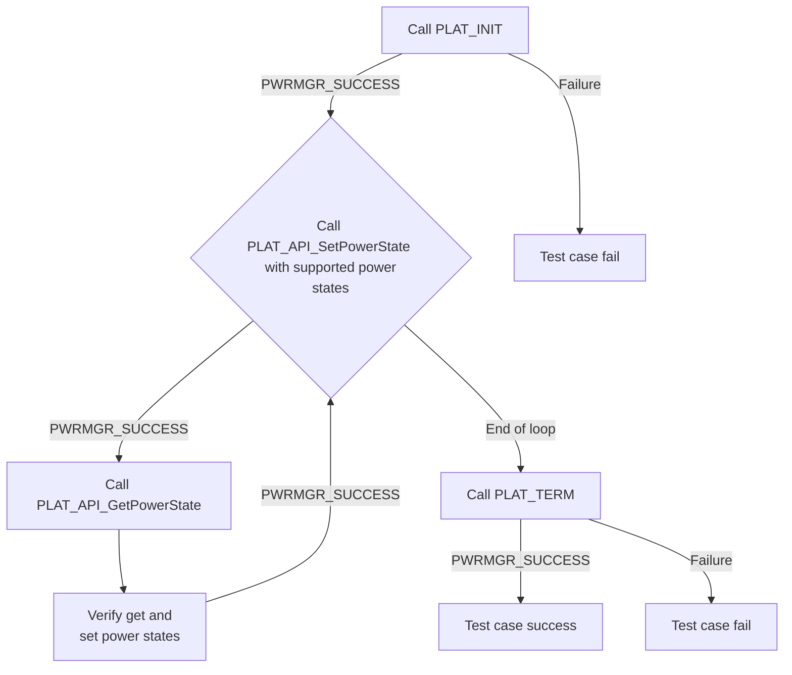
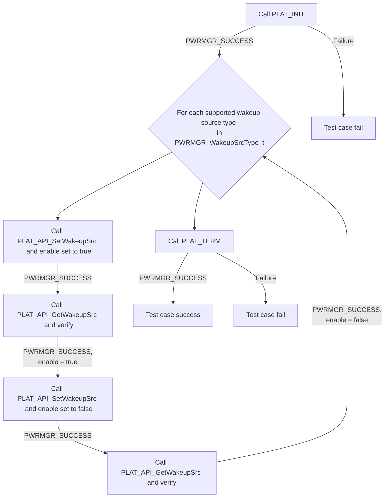

# Power Manager L2 Low Level Test Specification and Procedure Documentation

## Overview

This document describes the Low Level 2 Test Specification and Procedure for the PLAT POWER module.

### Acronyms, Terms and Abbreviations

- `HAL` \- Hardware Abstraction Layer, may include some common components
- `UT`  \- Unit Test(s)
- `OEM`  \- Original Equipment Manufacture
- `SoC`  \- System on a Chip

### Definitions

- `ut-core` \- Common Testing Framework <https://github.com/rdkcentral/ut-core>, which wraps a open-source framework that can be expanded to the requirements for future framework.

### References

- `High Level Test Specification` - [Power Manager High Level Test Spec](power-manager_High-Level_TestSpec.md)
- `HAL Interface file` - [Power Manager HAL header](https://github.com/rdkcentral/rdk-halif-power_manager/blob/main/include/plat_power.h)

## Level 2 Test Procedure

The following functions are expecting to test the module operates correctly.

### Test 1

|Title|Details|
|--|--|
|Function Name|`test_l2_plat_power_SetAndGetPowerState`|
|Description|Set various power states and retrieve it for verification|
|Test Group|02|
|Test Case ID|001|
|Priority|High|

**Pre-Conditions**
None

**Dependencies**
None

**User Interaction**
If user chose to run the test in interactive mode, then the test case has to be selected via console.

#### Test Procedure - Test 1

| Variation / Steps | Description | Test Data | Expected Result | Notes|
| -- | --------- | ---------- | -------------- | ----- |
| 01 | Initialize the platform using PLAT_INIT | None | PWRMGR_SUCCESS | Should be successful |
| 02 | Set supported power states using PLAT_API_SetPowerState | powerState = Read `powermanager.PowerStates` from the configuration file | PWRMGR_SUCCESS | Should be successful |
| 03 | Get the current power state using PLAT_API_GetPowerState and verify| getState = valid buffer | PWRMGR_SUCCESS, getState = powerState | Should be successful |
| 04 | Terminate the platform using PLAT_TERM | None | PWRMGR_SUCCESS | Should be successful |

### Test 2

|Title|Details|
|--|--|
|Function Name|`test_l2_plat_power_SetAndGetWakeupSrc`|
|Description|Set status of various wakeup sources and retrieves status for verification based on the platform configuration|
|Test Group|02|
|Test Case ID|002|
|Priority|High|

**Pre-Conditions**
None

**Dependencies**
None

**User Interaction**
If user chose to run the test in interactive mode, then the test case has to be selected via console.

#### Test Procedure - Test 2

| Variation / Steps | Description | Test Data | Expected Result | Notes|
| -- | --------- | ---------- | -------------- | ----- |
| 01 | Initialize the platform using PLAT_INIT | None | PWRMGR_SUCCESS | Should be successful |
| 02 | Set supported wakeup source to true using PLAT_API_SetWakeupSrc for each source type | srcType = Read `powermanager.WakeupSources` from configuration file, enable = true | PWRMGR_SUCCESS | Should be successful |
| 03 | Get supported wakeup source status using PLAT_API_GetWakeupSrc for each source type and verify| srcType = Read `powermanager.WakeupSources` from configuration file | PWRMGR_SUCCESS, enable = true | Should be successful |
| 04 | Set supported wakeup source to false using PLAT_API_SetWakeupSrc for each source type | srcType = Read `powermanager.WakeupSources` from configuration file, enable = false | PWRMGR_SUCCESS | Should be successful |
| 05 | Get supported wakeup source status using PLAT_API_GetWakeupSrc for each source type and verify| srcType = Read `powermanager.WakeupSources` from configuration file | PWRMGR_SUCCESS, enable = false | Should be successful |
| 06 | Terminate the platform using PLAT_TERM | None | PWRMGR_SUCCESS | Should be successful |

